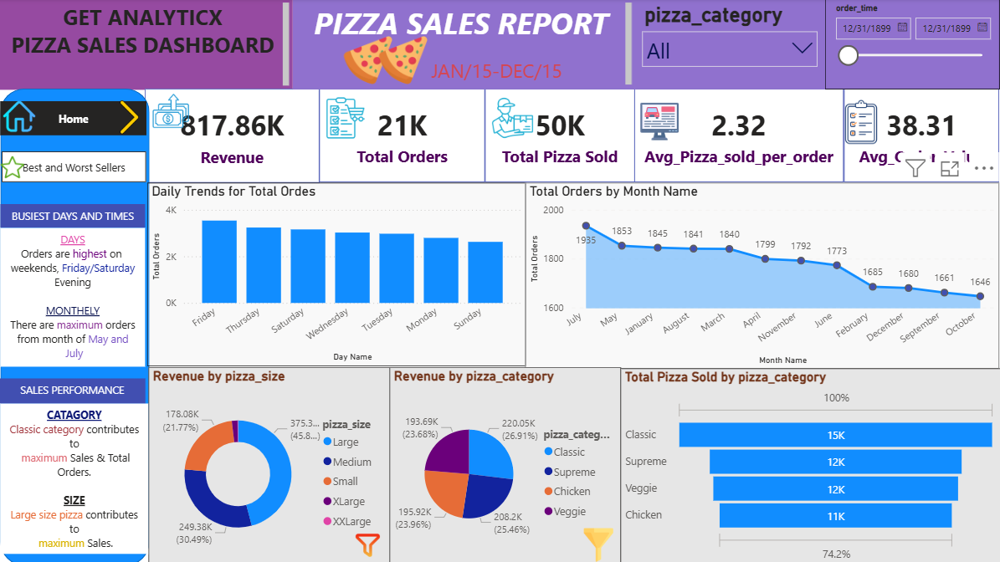

**Pizza Sales Analysis (Power BI)**

Project Overview

The Pizza Sales Dashboard is a data visualization project built using Power BI to analyze pizza sales data and identify important business insights.
This dashboard helps understand revenue trends, customer ordering patterns, and the performance of different pizza categories and sizes.
The goal of this project is to transform raw sales data into interactive and meaningful visual insights that support data-driven decision making.

Key Insights

- Total Revenue Generated: $817.86K
- Total Orders: 21K
- Total Pizzas Sold: 50K
- Average Pizzas per Order: 2.32
- Average Order Value: $38.31

Business Findings

- Weekends (Friday & Saturday evenings) have the highest order volume.
- Classic Pizza category contributes the highest sales.
- Large size pizzas generate the highest revenue.
- May and July have the maximum number of orders.

Dashboard Features

The dashboard contains the following visualizations:

- Daily trends for total orders
- Monthly order analysis
- Revenue by pizza size
- Revenue by pizza category
- Total pizzas sold by category
- Key KPI metrics for sales performance

Tools & Technologies Used

- Power BI
- Excel / CSV Dataset
- Data Visualization
- Business Intelligence

Dashboard Preview

Author

Sandhya Patel
